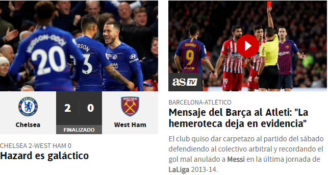
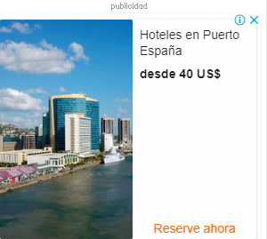
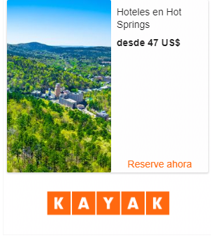

# Practica02-Mi-Sitio-Web-CSS-
Practica02 – Mi Sitio Web (CSS)
<!DOCTYPE html>
<html lang="en">

<head>
    <meta charset="UTF-8">
    <meta name="viewport" content="width=device-width, initial-scale=1.0">
    <meta http-equiv="X-UA-Compatible" content="ie=edge">
    <title>CRACKS</title>
    <link rel="stylesheet" href="./css/CSS.css" type="text/css">
</head>

<body>
    

        <header>
            <h1>
                CRACKS
            </h1>

            

        </header>
    

    

        <nav>
            <ul>
                <li>1 <a href="index.html">Página principal</a></li>
                <li>2 <a href="Noticias.html">Noticias</a></li>
                <li>3 <a href="Partidos.html">Partidos</a></li>
                <li>4 <a href="Traspasos.html">Traspasos</a></li>
                <li>5 <a href="Videos.html">Videos</a></li>
                <li>6 <a href="EquiposFav.html">Estadisticas</a></li>
                <li>7 <a href="FORMULARIO.html">Formulario</a></li>
            </ul>
        </nav>
    

    

        <section>
            <h2> PAGINA OFICIAL</h2>
            <article>
                

                    El informativo sobre fútbol internacional más grande y más visto de YouTube.
                    Las noticias, curiosidades,polémicas, videos y lo que no se ve en los noticieros,
                    AQUÍ. En la mejor pagina de fútbol
                

            </article>
        </section>

        <section>
            <aside>

                

            </aside>

        </section>
    

    

        <aside>
            
        </aside>
        <aside>
            
        </aside>
    

    

        <footer>

            Bryam Barrera &#8226; Universidad Politécnica Salesiana &#8226;
            telefono: <a href="tel:+593990496213">(593) 990-496-213</a> &#8226;
            Correo: <a href="mailto:bbarrerac1@est.ups.edu.ec">bbarrerac1@est.ups.edu.ec</a> &#8226;
            &#169; Todos los Derechos Reservados
        </footer>
    

</body>

</html>
